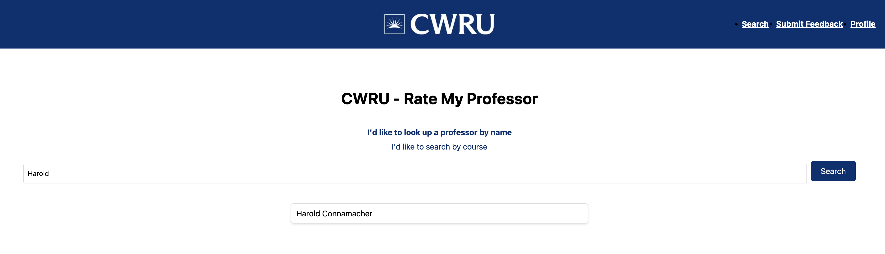

# CWRU RMP (CWRU Rate My Professor)

CWRU-RMP (Case Western Reserve University Rate My Professor) is a full-stack web application designed to help CWRU students evaluate and select professors based on peer feedback.

---

## Overview

CWRU RMP focuses on streamlining the process of searching for professors, browsing course feedback, and sharing reviews. By providing a comprehensive view of each professor's teaching style and class difficulty, students can make more informed decisions about their coursework.

---

## Features

- **Authentication**: Secure login and registration workflow

  
  
- **Professor/Course Search**: Search by Professor/Course
  
  

  

- **Review Submissions**: Students can create, edit, and delete their own reviews

  

---

## Architecture, Database Design, and Sequence Diagram

Below is a simplified view of the architecture, database design, and sequence diagram.

**Architecture**

**Database Design**

**Sequence Diagram**

